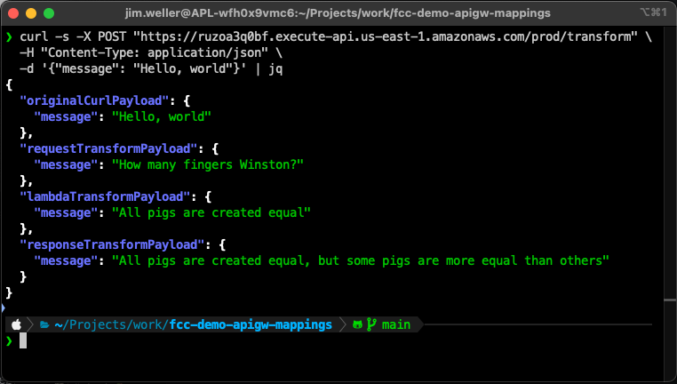

# Using API Gateway to Transform REQUESTS and RESPONSES

This is a simple example of using Apache VTL for API gateway (v1, REST) to do
transformations in the REQUEST and RESPONSE. This can be useful for application
architecture. For me, it's plumber-power.

Why is it plumber-powerful?

Using this method, you can connect API gateway directly to any AWS service that
has an endpoint. You only need to understand the API format of the AWS service.
AWS does this for their URL shortener. It is just API GW, VTL, and DynamoDB.

For example, you could take a customer payload and transform it to a format that
kinesis firehose would recognize, like

```json
  "DeliveryStreamName": "${firehoseStream.deliveryStreamName}",
  "Record": {
    "Data": base64Encode({ "message": "Hello, world" })
  }
```

This demo takes "hello, world" on an Orwellian JSON journey. Each transformation
step in the API gateway builds on the original message from the client until a
completely new message is returned. First the request ingregrations add some
text from 1984. Then the lambda adds part of Animal farm. Finally, the response
integration finishes Animal Farm.

Screenshot



The architecture is really only three tiers with a lot of moving parts inside of
API GW.


https://stackoverflow.com/questions/70251282/add-mapping-template-for-api-in-terraform
https://medium.com/@developerabs/api-gateway-integrating-directly-to-kinesis-firehose-6edb44d41aa7
https://www.youtube.com/watch?v=SlWJCTrMLOA
https://velocity.apache.org/tools/devel/tools-summary.html#JsonTool